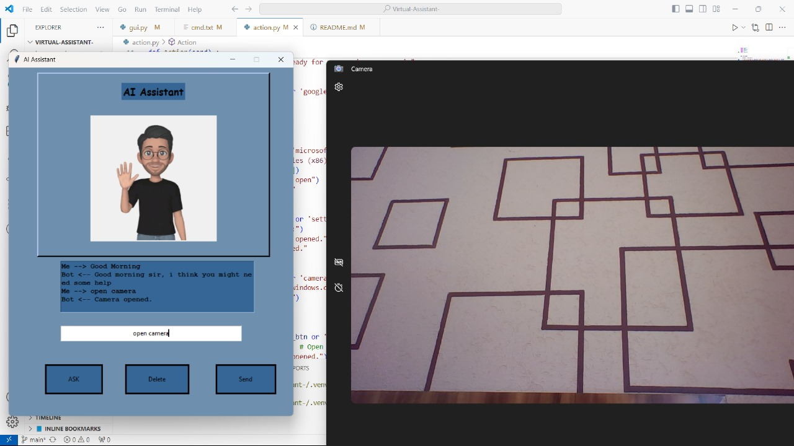
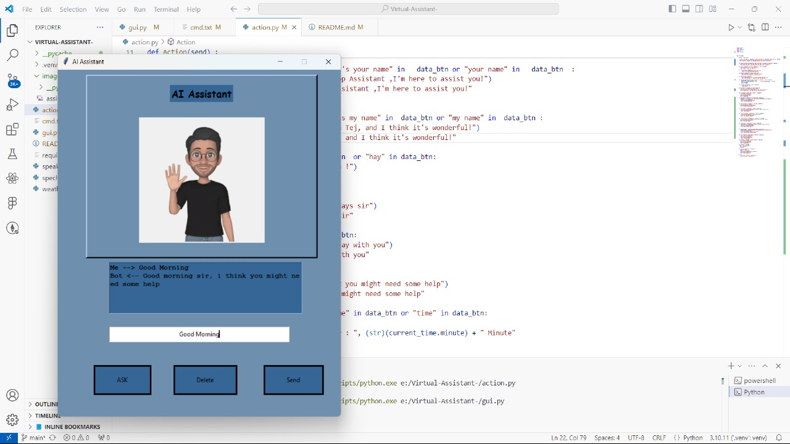
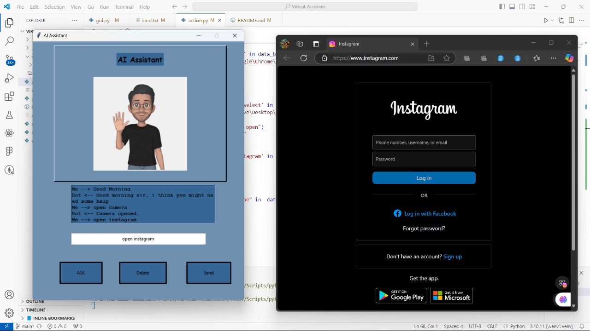

# Bittuuu - Your Personal Desktop Assistant 🤖

Bittuuu is a powerful and user-friendly virtual desktop assistant with a modern graphical user interface built in Python. It combines speech recognition, text-to-speech capabilities, and system automation to provide a seamless hands-free computing experience.

## ✨ Features

- **Modern GUI Interface**: Clean and intuitive interface with a dedicated chat window
- **Dual Input Methods**: 
  - Voice Commands (ASK button)
  - Text Input (Send button)
- **Interactive Chat Window**: Displays conversation history between user and assistant
- **Voice Recognition**: Understands and processes natural language commands
- **System Operations**: Control various system functions (camera, settings, file manager, etc.)
- **Web Integration**: Quick access to popular websites (Google, YouTube, Instagram)
- **Time Management**: Check current time and schedule tasks
- **Weather Updates**: Get real-time weather information
- **Media Control**: Play music from your local system
- **Application Control**: Launch and manage various applications

## 🖥️ Interface Components

- **Chat Display**: Large text area showing conversation history
- **Input Field**: Text entry for typing commands
- **Control Buttons**:
  - ASK: Activate voice command mode
  - Send: Submit typed commands
  - Delete: Clear chat history
- **Themed Design**: Professional blue color scheme (#6F8FAF, #356696)
- **Fixed Window Size**: 550x675 pixels for optimal viewing

## 🛠️ Prerequisites

- Python 3.10.11
- Windows Operating System
- Visual Studio Code (recommended)

## 🚀 Installation

1. Clone the repository:
```bash
git clone https://github.com/ramcharantejpuli/Virtual-Assistant-
cd Virtual-Assistant-
```

2. Create and activate a virtual environment:
```bash
python -m venv .venv
.\.venv\Scripts\activate
```

3. Install the required dependencies:
```bash
pip install -r requirement.txt
```

4. Additional required packages:
```bash
pip install pillow
pip install xml==4.9.1
pip install requests-html==0.10.0
pip install pyttsx3
pip install SpeechRecognition==3.8.1
pip install PyAudio==0.2.11
```

## 🎯 Available Commands

Bittuuu responds to various natural language commands through both voice and text:

### Personal Interaction
- "What is your name"
- "Hello/Hey/Hi"
- "How are you"
- "Thank you"
- "Good morning"

### System Operations
- "Time now"
- "Shutdown"
- "Open settings"
- "Open camera"
- "Open file manager"
- "Open calculator"

### Media & Web
- "Play music"
- "Open Google"
- "Open YouTube"
- "Open Instagram"
- "Open Edge"
- "Open Chrome"

### Information
- "Weather"
- "What's my name"

## 🖼️ Screenshots

### ✨ Your AI Companion Awaits


### 🤖 Intelligence at Your Fingertips


### 🚀 Seamless Voice & Text Integration


## 🚀 Running the Application

1. Activate your virtual environment:
```bash
.\.venv\Scripts\activate
```

2. Run the application:
```bash
python gui.py
```

## 🤝 Contributing

Contributions, issues, and feature requests are welcome! Feel free to check the issues page.

## ⭐ Creator

Created with ❤️ by **Puli Ram Charan Tej**

## 📝 Note

Make sure to adjust the paths of certain applications in `action.py` according to your system configuration for optimal performance.